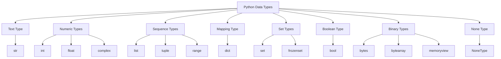
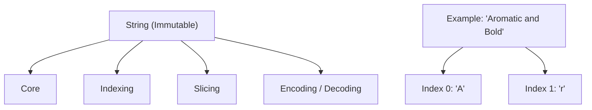
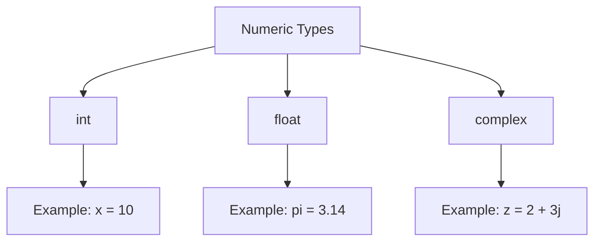
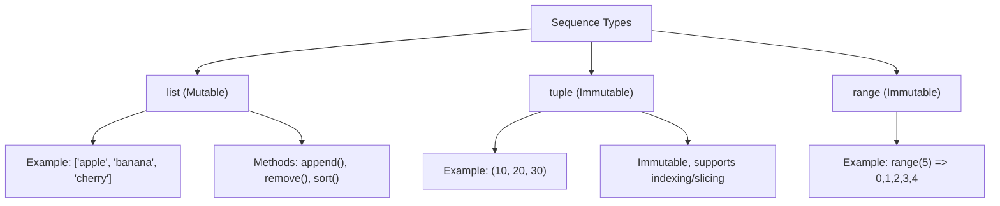
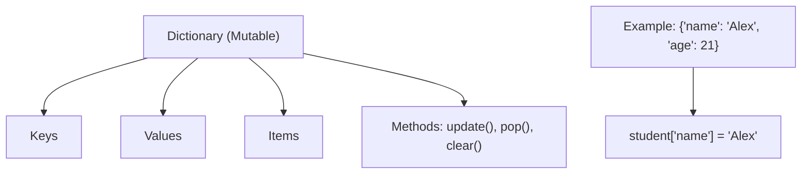
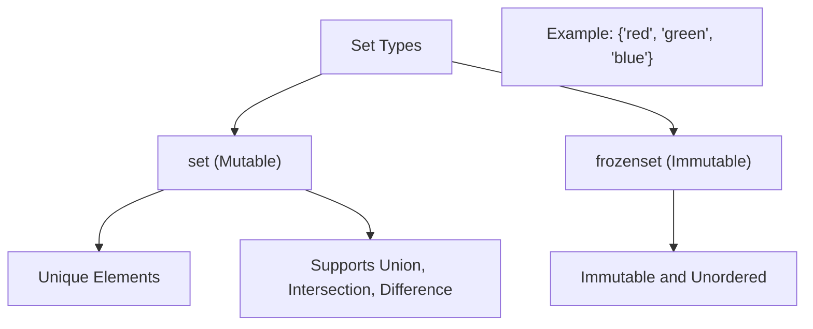
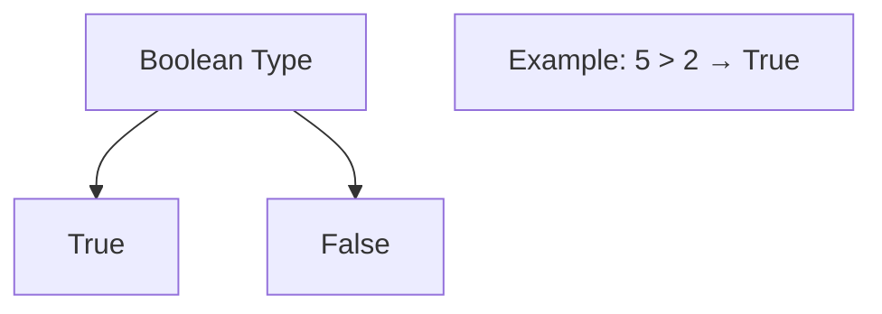
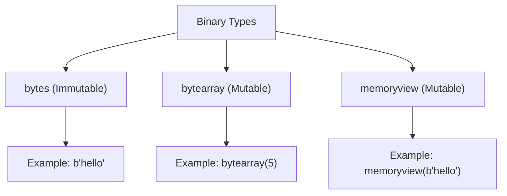
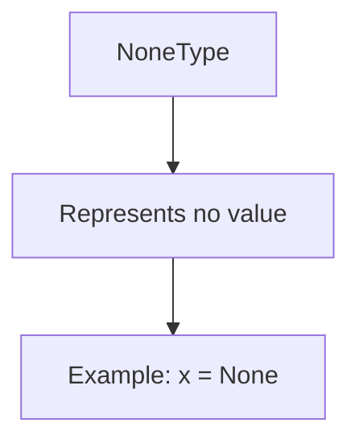
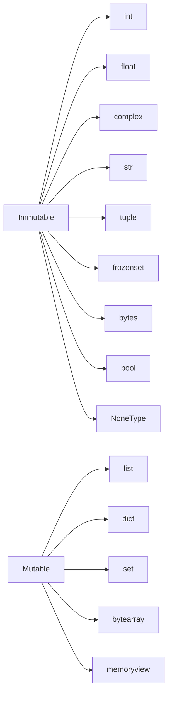

# 🧠 1. Python Built-in Data Types (Overview)



## 🧠 Python Data Types Overview

### **1. Standard Classification**

| Category       | Data Types                         |
| -------------- | ---------------------------------- |
| Text Type      | `str`                              |
| Numeric Types  | `int`, `float`, `complex`          |
| Sequence Types | `list`, `tuple`, `range`           |
| Mapping Type   | `dict`                             |
| Set Types      | `set`, `frozenset`                 |
| Boolean Type   | `bool`                             |
| Binary Types   | `bytes`, `bytearray`, `memoryview` |
| None Type      | `NoneType` (`None`)                |

---

## 🧩 **1. Text Type: String (`str`)**

**Immutable**

### Example

```python
name = "Aromatic and Bold"
```

### Operations

* Indexing → `name[0]  # 'A'`
* Slicing → `name[0:3]  # 'Aro'`
* Concatenation → `name + " Coffee"`
* Methods → `.upper()`, `.split()`, `.replace()`

### Diagram

```
String
 ├── core
 ├── indexing
 ├── slicing
 └── encoding-decoding
```

🧱 Immutable → once created, can’t change individual characters.



---

## 🔢 **2. Numeric Types**

### (a) **int**

Whole numbers (no decimals)

```python
x = 10
y = -3
```

### (b) **float**

Decimal or floating-point numbers

```python
pi = 3.14159
```

### (c) **complex**

Numbers with real and imaginary parts

```python
z = 2 + 3j
```

### Diagram

```
Numeric
 ├── int
 ├── float
 └── complex
```



---

---

## 📜 **3. Sequence Types**



### (a) **List**

**Mutable**

```python
fruits = ["apple", "banana", "cherry"]
fruits.append("mango")
```

* Indexing / slicing supported
* Can change, add, remove elements

**Diagram**

```
List
 ├── append()
 ├── remove()
 ├── slicing
 └── iteration
```

---

### (b) **Tuple**

**Immutable**

```python
coords = (10, 20, 30)
```

* Similar to list but can’t modify values.

**Diagram**

```
Tuple
 ├── indexing
 ├── slicing
 └── immutable
```

---

### (c) **Range**

Used with loops, generates sequences

```python
r = range(5)  # 0,1,2,3,4
```

---

## 🧭 **4. Mapping Type: Dictionary (`dict`)**



**Mutable**, key–value pairs

```python
student = {"name": "Alex", "age": 21, "grade": "A"}
print(student["name"])  # Alex
```

**Diagram**

```
Dictionary
 ├── keys()
 ├── values()
 ├── items()
 └── update(), pop()
```

---

## 🧮 **5. Set Types**



### (a) **set**

**Mutable**, unordered unique elements

```python
colors = {"red", "green", "blue"}
```

Operations: union, intersection, difference.

### (b) **frozenset**

**Immutable version of set**

```python
fset = frozenset(["a", "b", "c"])
```

---

## ⚙️ **6. Boolean Type (`bool`)**



```python
is_active = True
print(5 > 2)  # True
```

**Diagram**

```
Boolean
 ├── True
 └── False
```

---

## 🧵 **7. Binary Types**



| Type       | Mutable | Example                |
| ---------- | ------- | ---------------------- |
| bytes      | ❌       | `b"hello"`             |
| bytearray  | ✅       | `bytearray(5)`         |
| memoryview | ✅       | `memoryview(b"hello")` |

Used for low-level data manipulation, e.g. file I/O or networking.

---

## 🕳 **8. None Type**



Represents **absence of value**

```python
x = None
```

**Diagram**

```
NoneType
 └── represents no value
```

---

## 🔒 **Mutability Summary**

| Type       | Mutable | Example            |
| ---------- | ------- | ------------------ |
| int        | ❌       | 10                 |
| float      | ❌       | 10.5               |
| complex    | ❌       | 2+3j               |
| str        | ❌       | "hello"            |
| tuple      | ❌       | (1,2,3)            |
| list       | ✅       | [1,2,3]            |
| dict       | ✅       | {"a":1}            |
| set        | ✅       | {"a","b"}          |
| frozenset  | ❌       | frozenset({1,2,3}) |
| bool       | ❌       | True               |
| bytes      | ❌       | b"abc"             |
| bytearray  | ✅       | bytearray(3)       |
| memoryview | ✅       | memoryview(b"abc") |
| NoneType   | ❌       | None               |



---
